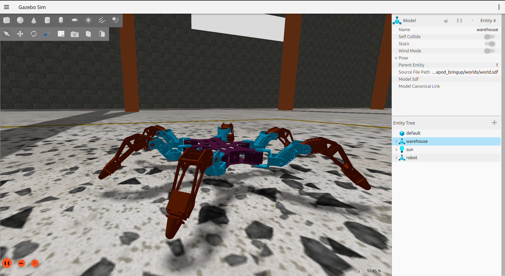
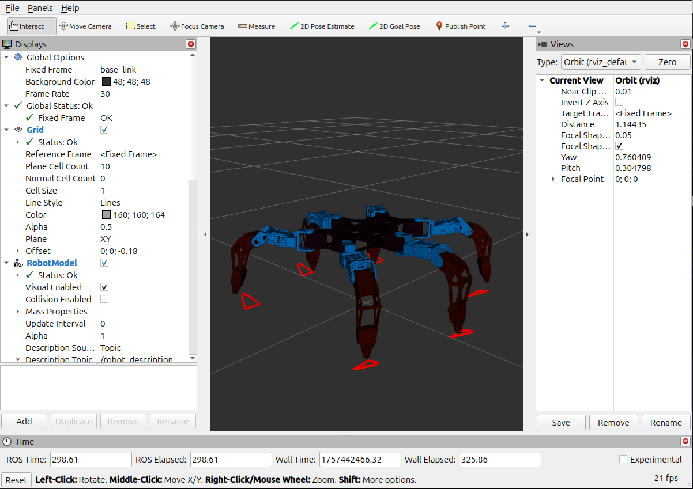
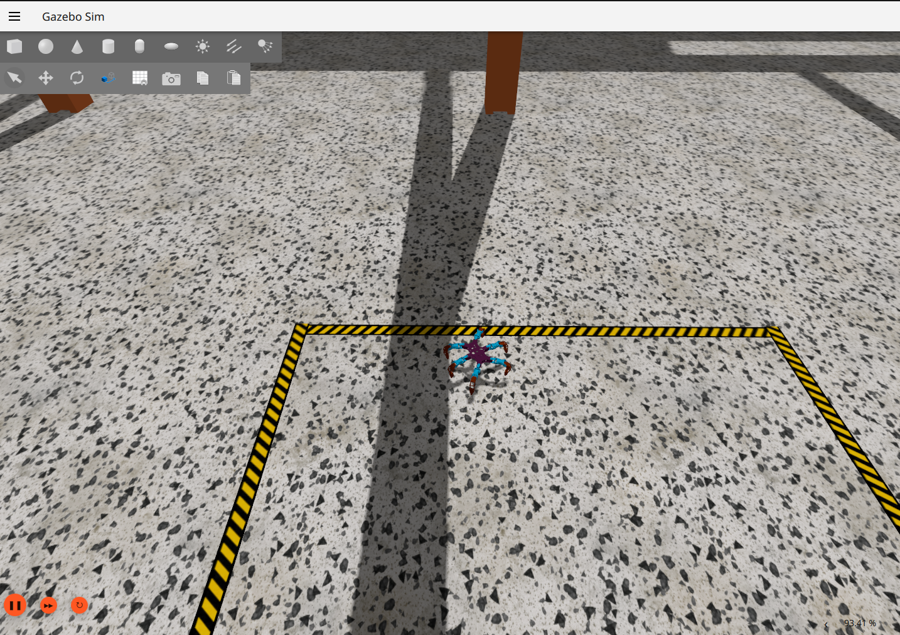

# Hexapod Simulator
A side-project exploring hexapod locomotion in simulation using ROS 2, Gazebo and a custom gait engine with inverse kinematics. The goal was to brush up on theory like Denavit-Hartenberg matrices and to deepen knowledge of legged robotics and inverse kinematics. Hardware and real assembly are out of the scope, so PhantomX AX Mark III was chosen due to its popularity in research community.

## Features
* Tripod gait engine with phase offsets
* Analytical inverse kinematics (IK) solver for a 3-DOF leg
* Integration with ros2_control and gz_ros2_control
* Effort interface with PID control (position control proved unusable for complex trajectories)
* Leg workspace (reach) visualization in RViz

Legs are indexed numerically against the clock starting from the left front leg. Visualized:
<pre>
       /front\
leg 1 |       | leg 6
      |       |
leg 2 |       | leg 5
      |       |
leg 3 |       | leg 4
       \_____/
</pre>

## Future plans
I like this project for its expandability. There's so much space to grow the sandbox: SLAM, navigation, rough terrain adaptability and so on.

* Try out different gait patterns (ripple, wave)
* Tune PID parameters
* Implement directional turning
* Add gamepad support
* Try out a real IK library like KDL or Track-IK
* Experiment with central pattern generators (CPGs) or reinforcement learning

## How to build
Create a ROS workspace with a child src directory. Clone the repository inside src folder: 
`mkdir -p ros_ws/src && cd ros_ws/src && git clone ...` 

REMINDER: colcon expects to build stuff on ROS workspace level, not inside repository root directory!!!

It's recommended to make use of Docker with [CUDA support](https://github.com/NVIDIA/nvidia-container-toolkit).
Build a runtime container: 
`docker build -t image_name --target runtime -f ros-jazzy-cuda.Dockerfile .` 
These dockerfiles support multistage building. To build a dev container: 
`docker build -t image_name --target dev -f ros-jazzy-cuda.Dockerfile .` 
Or better yet -- use Dev Containers VSCode extension. devcontainer.json file is already configured.

To run a container execute the following commands from the repo root directory: 
`xhost +local: && docker run -it --name test --network=host --ipc=host -v $PWD:/ros_ws/src/hexapod_simulation -v /tmp/.X11-unix:/tmp/.X11-unix:rw --env=DISPLAY --gpus all my_image`

## How to run
Inside a container (or locally) source the workspace: 
`source install/setup.sh`  
`ros2 launch hexapod_bringup gz_sim_main.launch.py`

And then in a new terminal call the service to transit to *standing* state: 
`docker exec -it CONTAINER_NAME bash` 
`ros2 service call /wake_up std_srvs/Trigger`

After the robot stood up, it can be controlled via keyboard teleoperation node: 
`ros2 run teleop_twist_keyboard teleop_twist_keyboard` 
"i" to move forward, "," to move backwards, "k" to halt.

To visualize joint movement without physical constraints, RViz and joint_state_publisher suffice: 
`ros2 launch hexapod_bringup basic_visualization_test_launch.xml`

## Testing
C++ core logic should be covered in unit tests. Google Test framework is used since it integrates with colcon nicely. 
Build the tests on ROS workspace level: 
`colcon test`

To examine the results: 
`colcon test-result --all --verbose`

## Credits
I’d like to gratefully acknowledge the following researchers whose work inspired and informed key aspects of this project:
- [**Kinematic and Dynamic Modeling of the PhantomX AX Metal Hexapod Mark III Robot using Quaternions**](https://www.researchgate.net/publication/356934434_Kinematic_and_Dynamic_Modeling_of_the_PhantomX_AX_Metal_Hexapod_Mark_III_Robot_using_Quaternions) 
Arnold Jean Pierre Acosta Chavez, Josmell Henry Alva Alcantara 
Though this paper's quaternion-based approach to dynamics is yet to be grasped, DH parameters and leg trajectory pattern generation equations proved useful for the project.

- [**Dynamic Modeling and Control of the Hexapod Robot Using MATLAB SimMechanics**](https://www.researchgate.net/publication/330405549_Dynamic_Modeling_and_Control_of_the_Hexapod_Robot_Using_Matlab_SimMechanics) 
Mohamed A. Kamel PhD., Abdelrahman Zaghloul M.Eng., Sameh I. Beaber M.Eng. 
This paper actually describes geometrical approach to inverse kinematics in detail (unlike the previous one)